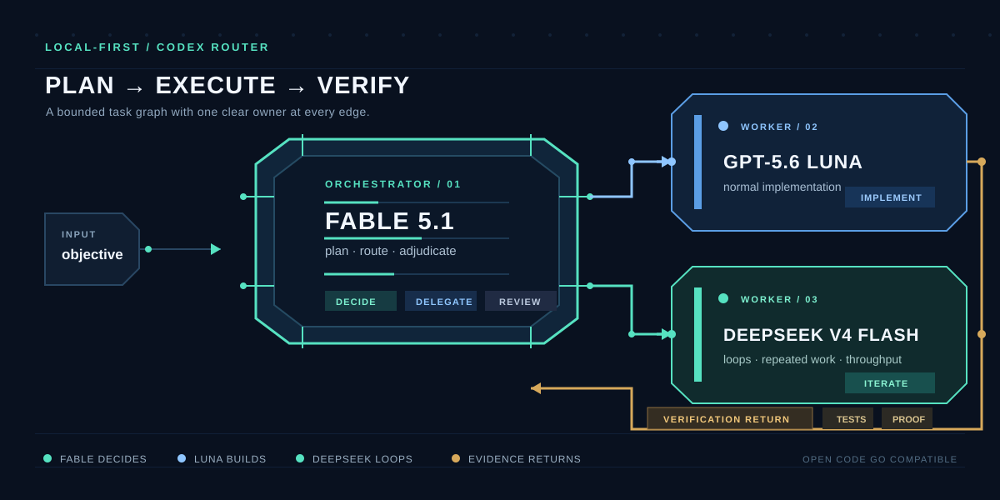

# Fable Orechester

A small, local-first routing skill for Codex. Fable plans and adjudicates — it doesn't
write code and it doesn't own your workspace. Codex stays in charge of the runtime and
hands bounded implementation work off to OpenCode Go agents:

- **GPT-5.6 Luna** — normal implementation
- **DeepSeek V4 Flash** — loops, repeated iteration, throughput jobs
- **Fable 5.1** — sits outside the implementation graph, only plans and adjudicates

The skill consumes the `opencode-go/` and `opencode-go-responses/` agents that ship
with Codex Router. There's no proxy, no dashboard, no model catalog, no credential
store, no API key in this repo. Configure OpenCode Go once in the router, then
restart Codex after you change a provider or agent definition.



## Layout

```text
skill/fable/
├── SKILL.md
├── agents/openai.yaml
└── scripts/ask_fable.sh
assets/orchestrator.svg
install.sh
tests/test_skill.sh
```

The three files under `skill/fable/` are the installable skill. `ask_fable.sh` is
executable and shells out to Claude Code's local `fable` alias with no session
persistence. Whatever you hand it should contain decisions and workspace facts —
never credentials.

## Install

From this repo:

```bash
./install.sh --dry-run    # print what would happen, change nothing
./install.sh --copy       # install to ~/.codex/skills/fable
```

`--copy` creates only the directories it needs and is safe to re-run. Pick a
different skills root if you want:

```bash
./install.sh --copy --target "$PWD/.local/codex/skills"
```

The installer only reads this repo and the destination path. It does not read,
create, or modify credentials. After you change a provider or agent definition,
start a fresh Codex task.

## Use

Invoke the skill with an objective:

```text
$fable build the feature
```

Fable hands back a bounded graph. Codex validates the graph, runs ready workers
in parallel when it's useful, collects their evidence, verifies the result, and
asks Fable to adjudicate whenever the task needs another decision. Every
implementation node must use GPT-5.6 Luna or DeepSeek V4 Flash. If neither
allowed OpenCode Go route is callable, the workflow surfaces the blocker
instead of inventing a model.

## Test

Run the dependency-light checks:

```bash
tests/test_skill.sh
```

The test exercises shell syntax, the copied source files, required routing
strings, basic YAML structure, optional `xmllint` XML validation, SVG safety
constraints, a temporary-home dry run, an idempotent copy, and common
credential-shaped strings. It does not need PyYAML or a live Claude login.

## License

MIT. See [LICENSE](LICENSE).
